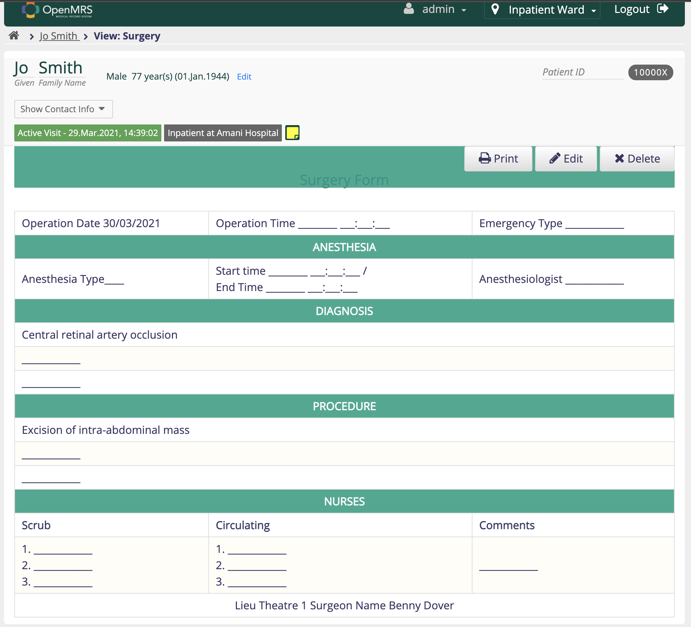
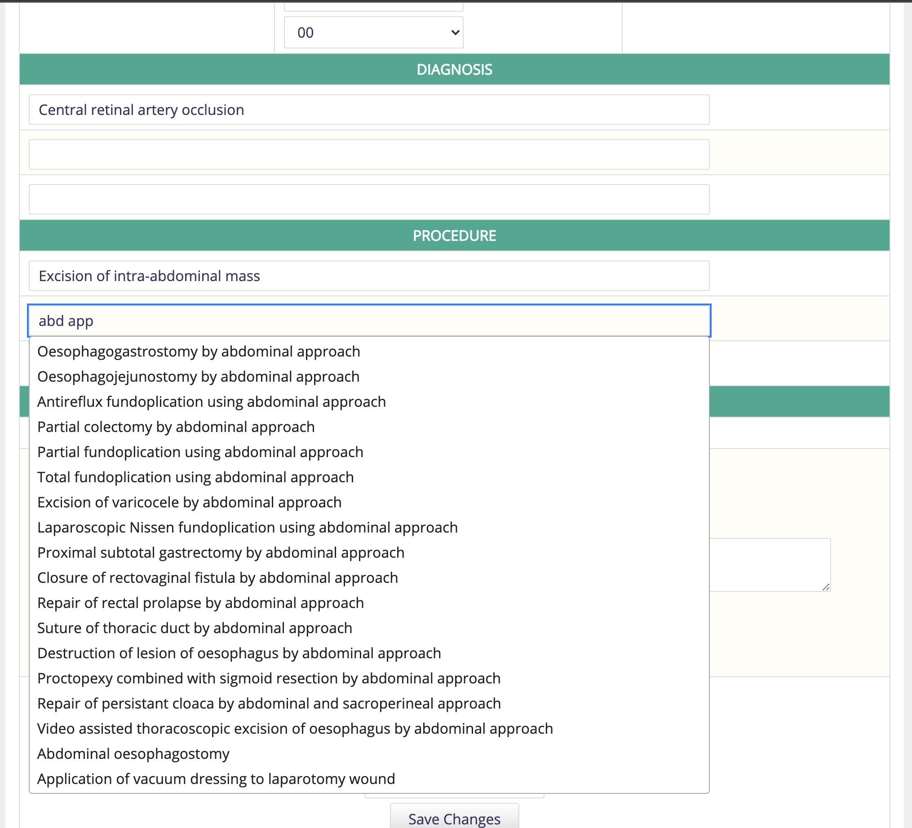
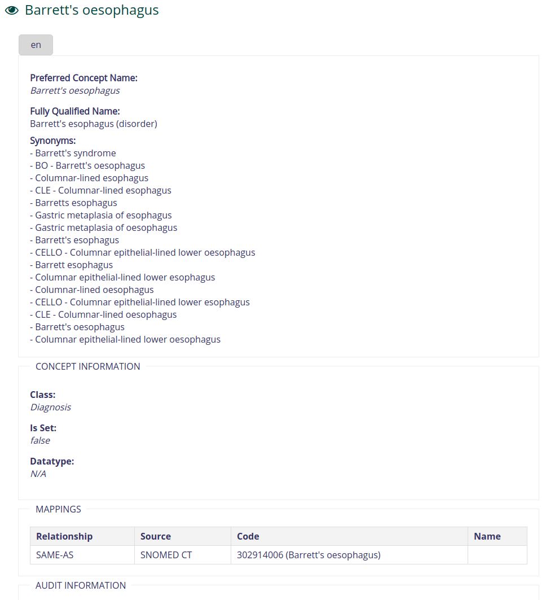

# openmrs-module-terminologysearch

A module for OpenMRS to search a FHIR terminology server for concepts.

## Description

Proof of concept module for search a FHIR based terminology server for SNOMED CT concepts.

## Building from Source

## Installation

1. Build the module to produce the .omod file.
2. Use the OpenMRS Administration > Manage Modules screen to upload and install the .omod file.

If uploads are not allowed from the web (changable via a runtime property), you can drop the omod
into the ~/.OpenMRS/modules folder.  (Where ~/.OpenMRS is assumed to be the Application 
Data Directory that the running openmrs is currently using.)  After putting the file in there 
simply restart OpenMRS/tomcat and the module will be loaded and started.

## Usage

The module adds a new tag for to be used with the htmlform module:

`terminologySearch`

which enables the use of a FHIR Terminology server to enter (and dynamically create, if needed) SNOMED Codes from FHIR ValueSets using FHIR's ValueSet/$expand operation.

Example usage is as follows:

```xml
<terminologySearch
  id="snomed-proc-field"
  conceptId="165181"
  conceptClass="Procedure"
  size="40"
  labelText="Admission type"
  fhirServerUrl="https://snowstorm-fhir.snomedtools.org/fhir"
  valueSetUri="http://snomed.info/sct?fhir_vs=isa/183452005" />
```

The supported parameters are:

| Attribute      | Default Value| Required     | Definition                                                            |
| :------------- | :----------- | :----------- |:----------------------------------------------------------------------|
| id             |              | Yes          | HTML element id.                                                      |
| conceptId      |              | Yes          | Question Concept.                                                     |
| fhirServerUrl  | Global Property terminologysearch.defaultFhirServerUrl or <https://snowstorm-fhir.snomedtools.org/fhir> if the global property does not exist. | No | FHIR Terminology Server endpoint.                        |
| valueSetUri    |              | Yes          | FHIR ValueSet URI.                                                    |
| conceptClass   |              | Yes          | Concept Class to use when dynamically creating Concepts.              |
| size           |              | No           | Optional value for size attribute of input field.                     |
| labelText      |              | No           | Label text for field (defaults to name of Question concept).          |
| index          | 0            | No           | If Question concept is used multiple times in the form, the index (zero-based) of this response. |
| prefetchAll    | false        | No           | Used for very small valuesets, this option will load all entries in the valueset and present in a dropdown. |
| includeDesignations | false   | No           |If set to true, the includeDesignations flag will be included when a query is made to the fhir server. This will bring back alternative names for the concept which will be included if a new new concept needs to be created. This increases the amount of data fetched from the fhir server. |

The global property `terminologysearch.defaultFhirServerUrl` is used to define the default FHIR server url to use.

Sample Form

```html

<htmlform>
    <macros>
        lightgrey=#e0e0e0
        lightblue=#2ea991
        green=#2ea991
        white=#ffffff
    </macros>
    <div style="background-color: $green;color:$white"><b>
        <center>Surgery Form</center>
    </b></div>
    <br/>
    <table border="1" width="99%" cellspacing="0" align="center" bgcolor="whitesmoke">
        <tr>

            <td>Operation Date
                <encounterDate/>
            </td>
            <td>Operation Time
                <obs conceptId="165180" allowFutureDates="true"/>
            </td>
            <td>Emergency Type
                <terminologySearch id="emergency" conceptId="165181" conceptClass="Procedure" size="40" labelText=""
                                   fhirServerUri="https://snowstorm-fhir.snomedtools.org/fhir"
                                   valueSetUrl="http://snomed.info/sct?fhir_vs=isa/183452005"/>
            </td>

        </tr>
        <tr>
            <td colspan="3" align="center" style="background-color: $green;color:$white"><B>ANESTHESIA</B></td>
        </tr>
        <tr>

            <td>Anesthesia Type
                <terminologySearch id="anesthesia" conceptId="165177" conceptClass="Procedure" size="40" labelText=""
                                   fhirServerUri="https://snowstorm-fhir.snomedtools.org/fhir"
                                   valueSetUrl="http://snomed.info/sct?fhir_vs=isa/50697003"/>
            </td>
            <td width="40%">Start time
                <obs conceptId="165178" allowFutureDates="true"/>
                /<br/> End Time
                <obs conceptId="165179" allowFutureDates="true"/>
            </td>
            <td>Anesthesiologist
                <obs conceptId="165182" answers="Nonine Vernéus,Yves-Rose Pierre Louis,Espinel Solius"/>
            </td>

        </tr>

        <tr>
            <td colspan="3" align="center" style="background-color: $green;color:$white"><B>DIAGNOSIS</B></td>
        </tr>

        <tr>
            <td colspan="3">
                <terminologySearch id="termSearch-1" conceptId="165190" conceptClass="Diagnosis" size="80" labelText=""
                                   index="0"
                                   fhirServerUri="https://r4.ontoserver.csiro.au/fhir"
                                   valueSetUrl="https://healthterminologies.gov.au/fhir/ValueSet/clinical-condition-1"/>
            </td>
        </tr>

        <tr>
            <td colspan="3">
                <terminologySearch id="termSearch-2" conceptId="165190" conceptClass="Diagnosis" size="80" labelText=""
                                   index="1"
                                   fhirServerUri="https://r4.ontoserver.csiro.au/fhir"
                                   valueSetUrl="https://healthterminologies.gov.au/fhir/ValueSet/clinical-condition-1"/>
            </td>
        </tr>

        <tr>
            <td colspan="3">
                <terminologySearch id="termSearch-3" conceptId="165190" conceptClass="Diagnosis" size="80" labelText=""
                                   index="2"
                                   fhirServerUri="https://r4.ontoserver.csiro.au/fhir"
                                   valueSetUrl="https://healthterminologies.gov.au/fhir/ValueSet/clinical-condition-1"/>
            </td>
        </tr>

        <tr>
            <td colspan="3" align="center" style="background-color: $green;color:$white"><B>PROCEDURE</B></td>
        </tr>
        <tr>
            <td colspan="3">
                <terminologySearch id="procedure-1" conceptId="165183" conceptClass="Procedure" size="80" labelText=""
                                   index="0"
                                   fhirServerUri="https://snowstorm-fhir.snomedtools.org/fhir"
                                   valueSetUrl="http://snomed.info/sct?fhir_vs=refset/1061861000168107"/>
            </td>
        </tr>
        <tr>
            <td colspan="3">
                <terminologySearch id="procedure-2" conceptId="165183" conceptClass="Procedure" size="80" labelText=""
                                   index="1"
                                   fhirServerUri="https://r4.ontoserver.csiro.au/fhir"
                                   valueSetUrl="https://healthterminologies.gov.au/fhir/ValueSet/sctau-reference-set-1061861000168107"/>
            </td>
        </tr>
        <tr>
            <td colspan="3">
                <terminologySearch id="procedure-3" conceptId="165183" conceptClass="Procedure" size="80" labelText=""
                                   index="2"
                                   fhirServerUri="https://r4.ontoserver.csiro.au/fhir"
                                   valueSetUrl="https://healthterminologies.gov.au/fhir/ValueSet/sctau-reference-set-1061861000168107"/>
            </td>
        </tr>

        <tr>
            <td colspan="3" align="center" style="background-color: $green;color:$white"><B>NURSES</B></td>
        </tr>
        <tr>
            <td><b>Scrub</b></td>
            <td><b>Circulating</b></td>
            <td><b>Comments</b></td>
        </tr>
        <tr>

            <td>1.
                <obs conceptId="165185"
                     answers="Alourdes Emile,Anaromie Blanc,Edline Exinord,Jeanine Jean Lor,Jeronne Thelusmé,Marjorie Etienne,Rosette Vilna,Wastaline Charles"/>
                <br>
                2.
                <obs conceptId="165185"
                     answers="Alourdes Emile,Anaromie Blanc,Edline Exinord,Jeanine Jean Lor,Jeronne Thelusmé,Marjorie Etienne,Rosette Vilna,Wastaline Charles"/>
                </br> <br>
                3.
                <obs conceptId="165185"
                     answers="Alourdes Emile,Anaromie Blanc,Edline Exinord,Jeanine Jean Lor,Jeronne Thelusmé,Marjorie Etienne,Rosette Vilna,Wastaline Charles"/>
                </br>
            </td>
            <td>1.
                <obs conceptId="165186"
                     answers="Alourdes Emile,Anaromie Blanc,Edline Exinord,Elioné Billion,Jeanine Jean Lor,Jeronne Thelusmé,Marjorie Etienne,Mireille Jean,Nacha Betty Benoit,Rosette Vilna,Wastaline Charles,Wilner Alcene"/>
                <br>
                2.
                <obs conceptId="165186"
                     answers="Alourdes Emile,Anaromie Blanc,Edline Exinord,Elioné Billion,Jeanine Jean Lor,Jeronne Thelusmé,Marjorie Etienne,Mireille Jean,Nacha Betty Benoit,Rosette Vilna,Wastaline Charles,Wilner Alcene"/>
                </br> <br>
                3.
                <obs conceptId="165186"
                     answers="Alourdes Emile,Anaromie Blanc,Edline Exinord,Elioné Billion,Jeanine Jean Lor,Jeronne Thelusmé,Marjorie Etienne,Mireille Jean,Nacha Betty Benoit,Rosette Vilna,Wastaline Charles,Wilner Alcene"/>
                </br></td>

            <td>
                <obs conceptId="165184" style="textarea"/>
            </td>
        </tr>

        <tr>
            <td colspan="3" align="center"> Lieu
                <encounterLocation default="9" order="9"/>
                Surgeon Name
                <encounterProvider role="Surgeon"/>
                <submit/>
            </td>
        </tr>
    </table>
</htmlform>
```




## Creating Concepts

The FHIR terminology server will return values with a `system` and a `value`. This is because a FHIR ValueSet can include
concepts from more than one CodeSystem. The system value indicates the CodeSystem the value is derived from.

To generate a new concept in OpenMRS the module needs to know

1. The OpenMRS Concept Class
2. The OpenMRS Concept Source associated with the FHIR `system` of the value.

The concept class is set in the `conceptClass` attribute of the htmlform tag.  

The concept source is determined by using a global property called `terminologysearch.system_to_conceptSource_map`.
This variable should contain a json representation of the mappings. For example

```json
[
  {"system":"http://snomed.info/sct", "conceptSource": "SNOMED CT"},
  {"system": "http://loinc.org", "conceptSource": "LOINC"}
]
```

Will map the system of `http://snomed.info/sct` to a concept source with the name `SNOMED CT` and `http://loinc.org`
to the concept source with the name `LOINC`.

If the option `includeDesignations` is set to true, then the module will ask the FHIR server to include designations
when searching the ValueSet. If the FHIR CodeSystem includes extra names for the concept, they will be returned. For 
a SNOMED CT ValueSet this will include the fully specified name, the preferred name and any synonyms. All of these 
additional designations will be added to any created concept. If the flag is set to false, then the FHIR terminology
server will only return the preferred name and no additional names will be added for the concept in OpenMRS.

This images shows a created concept when designations are included.


## ValueSets

### SNOMED CT Implicit ValueSets

SNOMED CT covers a very large number of concepts, in nearly all cases it is not desirable to search the whole thing.

The FHIR specification details a set on `implicit` value sets that are available for SNOMED CT
<https://www.hl7.org/fhir/snomedct.html#implicit>

There are three main variants of interest when using this plugin:

1. Reference Set  
A reference set is a curated set of SNOMED CT concepts. The value set uri for a reference set is given by:
   `http://snomed.info/sct?fhir_vs=refset/[sctid]` where sctid is the id of the reference set. You can find out more
   about reference sets at <https://confluence.ihtsdotools.org/display/DOCRFSPG/Practical+Guide+to+Reference+Sets>

2. IS-A  
An isa implicit value set includes a root concept and all of its child concepts. The value set uri in the first example
   is `http://snomed.info/sct?fhir_vs=isa/183452005` Snomed Concept 183452005 is `Emergency hospital admission (procedure)`
   so this value set represents all the different types of emergency hospital admissions. 
   The value set uri for isa is given by: `http://snomed.info/sct?fhir_vs=isa/[sctid]` where sctid is the id of the 
   root concept. To explore the SNOMED CT hierarchy you can use a tool like Shrimp <https://ontoserver.csiro.au/shrimp>

3. Expression Constraint Language (ECL)  
An ECL implicit value set is derived by applying some provided ECL code. ECL is custom syntax for selecting groups of
   concepts from SNOMED CT. <https://confluence.ihtsdotools.org/display/slpg/snomed+ct+expression+constraint+language>
   The value set uri for ecl is given by: `http://snomed.info/sct?fhir_vs=ecl/[ecl]` where ecl is the ecl expression.
   An example ecl expression is
   `< 125605004 |Fracture of bone| . 363698007 |Finding site|`  
   which returns all finding sites (body parts) which can have a fracture of bone (disorder)

### LOINC Implicit ValueSets

LOINC defines a set of Answer lists, each of which contains a set of LOINC codes. 
LOINC answer lists are available as implicit value sets using the url `http://loinc.org/vs/[id]` where id is the loinc
code for the answer list. For example `http://loinc.org/vs/LL715-4` gives the platelet morph answer list.

### Other ValueSets

The FHIR terminology server used may define other value sets which may be used. The example form above makes use of value
sets of urls with the form `https://healthterminologies.gov.au/fhir/ValueSet/[name]` These value sets are defined and maintained 
by the Australian Digital Health Agency for use in an Australian clinical setting. Other countries have similar agencies.
A tool like Shrimp <https://ontoserver.csiro.au/shrimp> can be used to explore the ValueSets available in your terminology
server.
